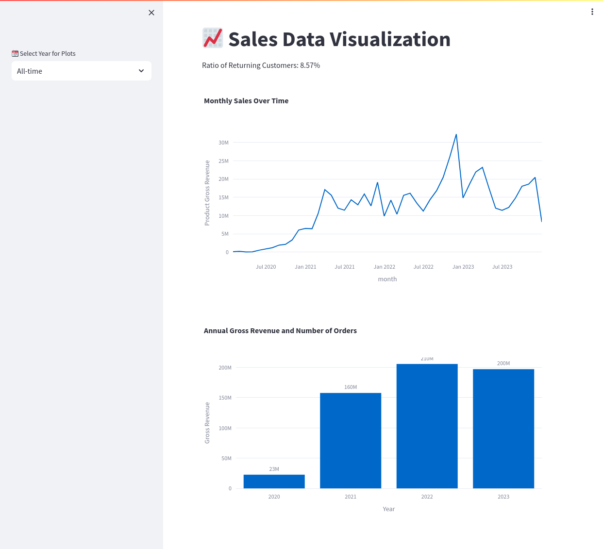
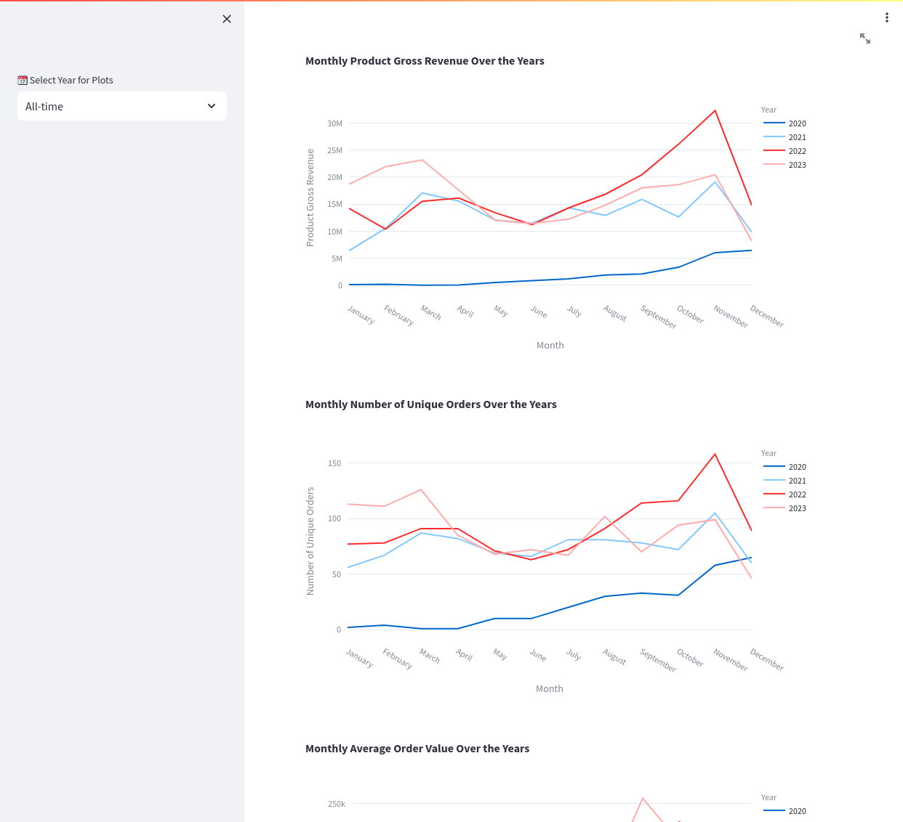
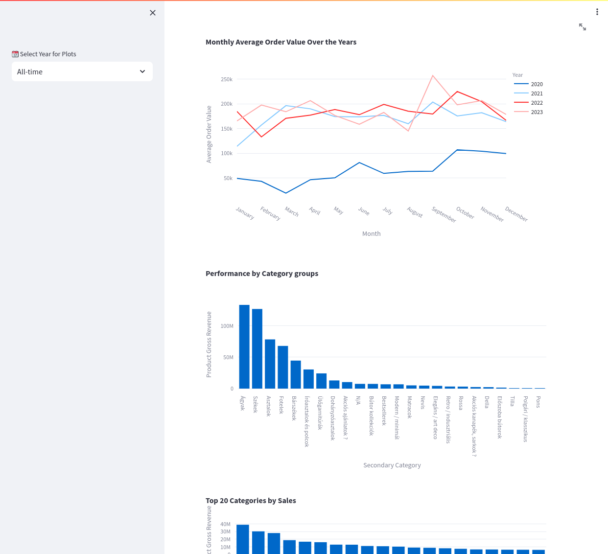
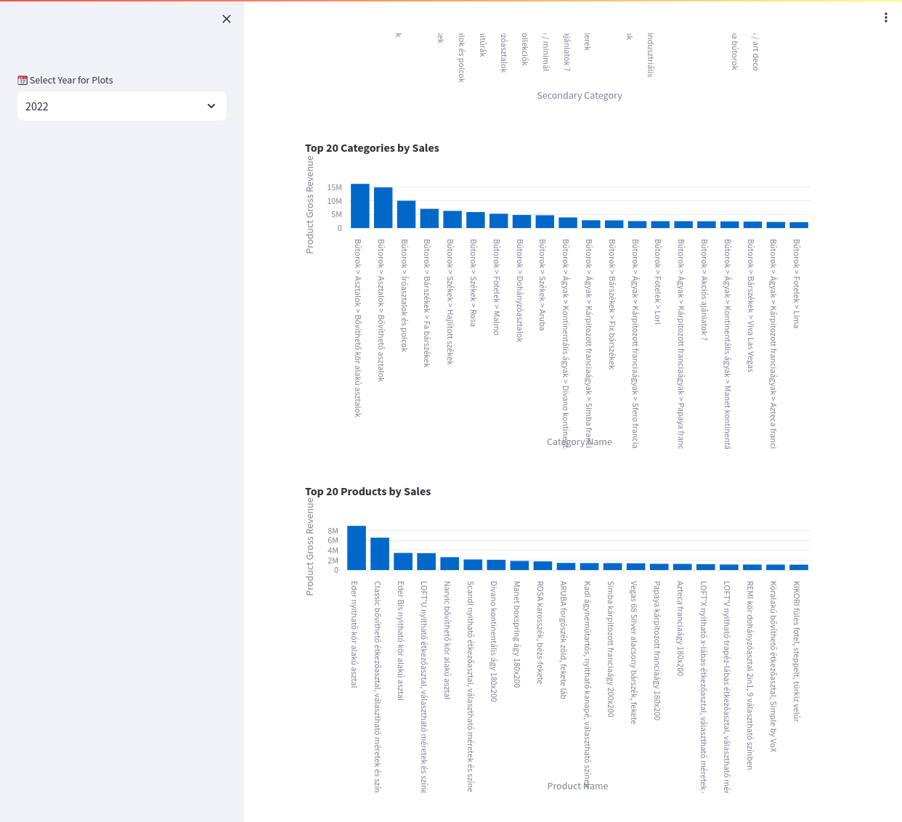

# WooCommerce Sales Dashboard from DB Dump

## Dashboard Screenshots

<table>
  <tr>
    <td></td>
    <td></td>
    <td></td>
  </tr>
  <tr>
    <td></td>
    <td></td>
    <td></td>
  </tr>
</table>


## Introduction
This project provides a sales dashboard for WooCommerce data, using MySQL for database management and Streamlit for interactive data visualization. It's designed to help you gain insights into sales trends, customer behaviors, and product performance based on your WooCommerce data.

## Prerequisites
Before you begin, ensure you have the following installed:
- Docker

## First Step: Prepare Your WooCommerce Data
1. **Obtain Your WooCommerce Data Dump:**
   - Export your WooCommerce database as a `.sql` file.
   - Name the file `dump.sql`.

2. **Place `dump.sql` in the Project Directory:**
   - Download or copy your `dump.sql` file.
   - Place it alongside the `start.sh` script in the cloned repository.

   Your directory structure should look like this:

```bash
WooCommerce-Analytics/
├── start.sh
├── dump.sql
├── [other project files]
```

## Installation and Setup
1. **Clone the Repository:**

```bash
git clone https://github.com/lugosidomotor/WooCommerce-Analytics.git
cd WooCommerce-Analytics
```

2. **Start the Database and Import Data:**
- To initialize the MySQL Docker container, import your WooCommerce data, and start the Streamlit application, execute the `start.sh` script with sudo privileges:

```
sudo bash start.sh
```

3. **Access the Streamlit Application:**
- After running the `start.sh` script, the Streamlit application should automatically start and be accessible at `http://localhost:8501`.

## Using the Dashboard
The Streamlit dashboard provides various visualizations and analyses, such as:
- Monthly and yearly sales trends.
- Ratio of returning customers.
- Geographical distribution of sales.
- Top-performing products and categories.
- Average order value over time.

Explore these metrics to gain valuable insights into your WooCommerce business performance.

## Shutting Down
To stop the Streamlit application and the MySQL Docker containers, execute the following commands:

```
docker stop streamlit woo-dump-mysql && docker rm streamlit woo-dump-mysql
```
